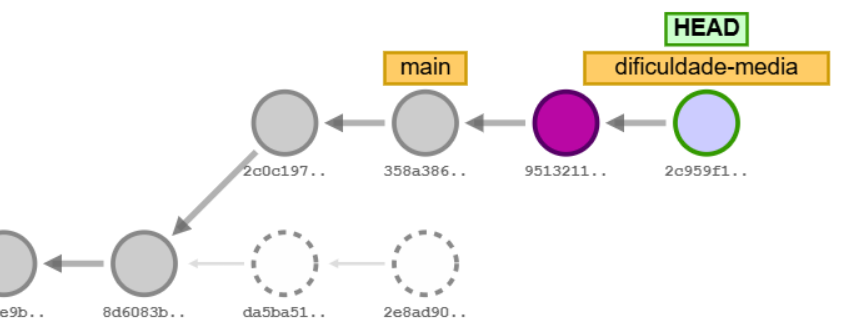
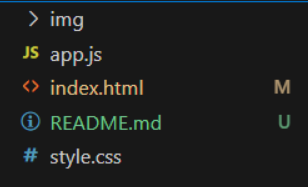
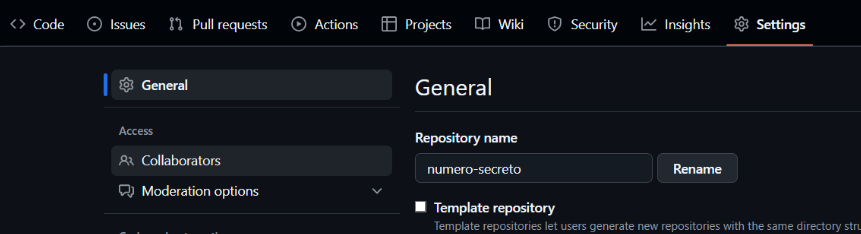
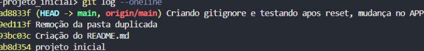
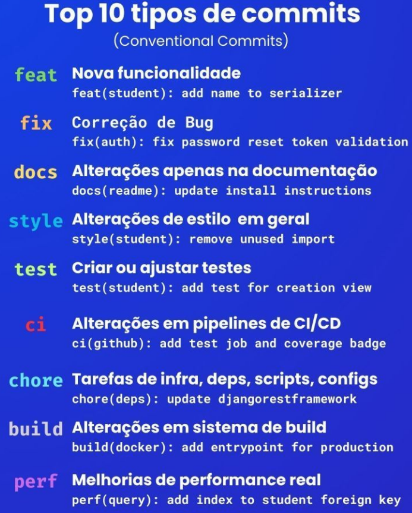

# Conhecendo GitHub & Git

Neste documento irei dar um breve resumo de como utilizar comandos do GitHub.

##### Github oferece hospedagem de projetos, facilitando o compartilhamento de Códigos.

------------------------------------------------------------------------
**Criação de Repositórios:**
#### [Terminologia do repositório](https://docs.github.com/pt/repositories/creating-and-managing-repositories/about-repositories#repository-terminology)

Antes de começar a usar repositórios, aprenda esses termos importantes.

|Termo|Definição|
|---|---|
|Branch|Uma versão paralela do código que está contida dentro do repositório, mas não afeta a ramificação primária ou principal.|
|Clone|Baixar uma cópia completa dos dados de um repositório de GitHub.com, incluindo todas as versões de cada arquivo e pasta.|
|Fork|Um novo repositório que compartilha configurações de código e visibilidade com o repositório "upstream" original.|
|Mesclar|Pegar as alterações de um branch e aplicá-las à outra.|
|Solicitação de pull|Uma solicitação para mesclar as alterações de um branch em outro.|
|Remoto|Um repositório armazenado no GitHub, não no seu computador.|
|Upstream|O branch em um repositório original em que foi criado um fork ou clonado. O branch correspondente no repositório clonado ou em que o fork foi criado é chamado de "downstream".|

###### OBS: Git -> Ferramenta de controle de versões do código.

> [!NOTE]
> Mesmo fazendo novas instalações e abrindo um novo terminal, o Windows ainda por dar problemas de detecção de instalações novas, esse problema está relacionado a algo chamado de **"Variáveis de Ambiente"**. 
> 
> Desta forma você deve acessar as **"Editar as Variáveis de Ambiente do Sistema"**, pesquisando na aba de pesquisa do Windows, na opção **"Variáveis de Ambiente"**, você vai na parte inferior e procura *Path* e dentro você verifica se existe o caminho, se não, você cria um novo e se existir e não funcionar, você verifica o caminho para ver se a documentação necessária está correta.

#### Comandos para transformação de uma documentação em um arquivo Git para repositórios do GitHub:

> [!NOTE REPOSITORIO]
> Na criação de um repositório no Github se cria algo chamado de "Repositório Remoto", porém para o conexão do projeto também precisamos de um "Repositório Local". E depois disso criar a sua conexão.

*git* init  -> Inicializa o git na pasta, permitindo o uso de git bash.

*git* add   -> Adiciona arquivos no projeto.

*git* add `.` -> Adiciona TODOS arquivos no projeto.

*git* commit `-m` **"Projeto Inicial"** -> Cria a mensagem do "commit" do projeto.

> [!COMMIT comando]
> Para o commit é necessário a identidade do autor, afinal não tem como dar commit se não sabe quem é o dono do commit. Para isso é requisitado alguns passos para a identificação.
> 
> *git* config `--global` user.email **"johndoe@exemplo.com"**
> *git* config `--global` user.name **"Seu nome"**
> 
> ###### OBS: O termo "--global" faz com que o computador inteiro saiba que esse é você, dessa forma sendo desnecessário configurar novamente. 
> 
> São comandos para você se identificar localmente, afinal você está conectado no remoto, isso é no site GitHub, porém o git não sabem quem é você.
As mensagens dos commits devem ser **simples e objetivas**. A seguir, listamos algumas orientações para isso:

> [!Mensagens no Commit!]
> As mensagens dos commits devem ser **simples e objetivas**. A seguir, listamos algumas orientações para isso:
> 
> - **Mantenha a mensagem curta e concisa:** A primeira linha da mensagem deve conter, no máximo, 72 caracteres. Caso seja necessário uma descrição adicional, você deve pular uma linha e adicionar os detalhes, como o contexto, da mudança realizada.
>     
> - **Uso de verbo no infinitivo:** É comum que a mensagem do commit inicie com um verbo no infinitivo que descreva a alteração feita, como “adicionar”, “corrigir” ou “atualizar”. Em sequência, são adicionados detalhes concisos da mudança. Por exemplo: “Atualizar texto do título da página”.
>     
> - **Evite detalhes técnicos**: Não inclua detalhes técnicos complexos na mensagem de commit. Esses detalhes podem ser adicionados nos comentários de código ou na documentação.

> [!Commit com co-autor]
> O Git oferece a possibilidade de adicionar **mais de um autor** a um commit. Para isso, após escrever a mensagem do commit, pulamos duas linhas e usamos a palavra-chave `Co-authored-by:`, seguido do nome e e-mail associado ao GitHub (entre < >) de cada pessoa colaboradora.
> 
> git commit -m "Adicionar nova funcionalidade.
> >
> >
> Co-authored-by: NOME <nome@email.com>
> Co-authored-by: OUTRO-NOME <outro@email.com>"

*git* branch `-M` main

*git* remote `add` origin https://github.com/JohnSugahara/numero-secreto

> [!REMOTE]
> ###### OBS: É necessário que você insira o link SEM /tree e branch, caso contrario a ponte remota não funcionará. 
> 
> O remote pode ser usado tanto para link HTTPS como SSH

*git* push `-u` origin main

> [!PROBLEMA NO PUSH]
> Caso você já tenha tido commits no arquivo do repositório ele vai reclamar e barrar seu push, você então pode ou dar pull para resgatar os commits para depois dar push, ou, você pode lançar o comando:
>  "*git* push `-u` origin main `--force`", 
>  dessa forma apagando o histórico de commits.

> [!SEGURANÇA CHAVE SSH]
> Se for a sua primeira vez dano o comando de push é provável que ele peça para você criar uma chave SSH, deixando mais seguro o seu acesso. Isso ocorre quando você conecta pela primeira vez, ou ele não reconhece a maquina que você está usando como uma conhecida, sendo assim uma boa medida de segurança.

*git* commit `--amend` `-m` **"Mensagem Correta"** -> Corrige a a ortografia do ultimo commit. 

*git* clone https://github.com/JohnSugahara/numero-secreto -> Esse comando permite que o usuário clone um repositório do GitHub, porém diferente do zip ele carrega todas informações, incluindo commits já feitos. (Comando bastante usado para caso o usuário precise de um repositório que não criou mas precisa trabalhar no mesmo)

*git* status -> Ele mostra o que foi modificado antes de dar o commit, caso você pare o projeto no meio de um commit e/ou alteração. Ele mostra arquivos alterados em relação ao repositório e se você já preparou um commit.

*git* log -> Ele mostra os históricos de commits, mostrando não só o autor como data do commit realizado junto com um código do mesmo.

*git* log `--oneline` -> Mostra apenas o nome dos logs.

*git* log `-p` -> Igual o log, mas mostra o diff.(quais mudanças foram feitas.)

*git* log `--graph` -> Mostra a linha do tempo das branchs.

*git* pull -> Ele puxa commits que estão no remoto para o local, dessa forma atualizando o repositório local.[^1](É interessante lançar um *git* log, para verificar se foi puxado corretamente)

*git* revert **exempleid123gt564fbce** -> Ele pega o commit a partir do código do *git* log, dessa forma ele pega o commit, retorna ele para a forma anterior do commit e dessa forma ele cria um novo commit dessa reversão. 

*git* reset `--hard` **exempleid45fbc89det94** -> Da mesma forma que o revert, você utiliza o id do *git* log, dessa forma deletando o commit do histórico. Porém o id que deve ser usado é o id do commit anterior do que você quer pagar, pois ele volta para aquele commit, esquecendo os novos commits.

*git* show **exemple9fsetf** -> Mostra o diff do log especifico.

*git* diff -> Ele mostra o que foi modificado porem com mais detalhes, mostrando o código antes e depois da alteração entre dois pontos.

*git* branch -> Mostra todas branch existentes no projeto.

*git* branch -d **nomedabranch** -> Deleta a branch.

*git* checkout **nomedabranch** -> Troca de branch.

*git* checkout `-b` **nomedabranch** -> Cria e troca para branch recém-criada .

> [!Por que o checkout e switch são tão parecidos?]
> Os comandos de checkout são uma alternativa velha, devido a sua complexidade ele foi separado em outros comandos, como exemplo o switch, que faz parte de suas funcionalidades. Ou seja, *git* switch e *git* restore fazem as mesmas coisas que o comando checkout faz porém de maneira mais especifica e menos confusa.

*git* switch **nomedabranch** -> Troca para outra branch.

*git* switch `-c` **nomedabranch** -> Cria a branch e troca para a mesma.

*git* push origin :**nomedabranch** -> Deleta no remoto a branch(No repositório).

*git* rebase **nomedabranch** -> Ele reescreve a ordem dos commits, pegando a branch que você está e fazendo que os commits dela aconteçam depois da main. Exemplo:

*git* stash -> Ele guarda as alterações feitas no código, para que possa ser acessadas depois caso precise fazer outra coisa no momento.

*git* stash -m **"testando comando"** -> Guarda porém com informações mais descritivas para o stash list.

*git* stash pop -> Pega o que está guardado no stash e aplica no código. Ele sempre empilha as modificações, ou seja, em uma lista ele vai dar pop na de índice 0, depois a de índice 1 e assim por diante.

*git* stash list -> Mostra o historio dos stash feitos.

*git* stash apply **numero** -> Para aplicar um pop seleto. 

*git* stash drop -> Ele remove o ultimo item guardado no stash, sem aplica-lo. 

*git* restore . -> Ele da restore para a HEAD, removendo as modificações do projeto.

*git* restore **nomedoarquivo** -> Faz a mesma coisa do restore . , porem apenas para o arquivo escolhido.

*git* restore `--staged` -> Remove um arquivo do stage.
> [!O que são arquivos staged?]
> **Arquivos Staged:**
> 
> É quando um arquivo foi adicionado pelo git add, dessa forma ele está preparado, no caso estagiado para entrar no próximo commit. Para remover ele do stage, no caso dar 'unstage' é necessário o uso do comando: *git* restore `--staged` nome para tirar.

*git* restore --source=iddocommit **nomedoarquivo** -> Vai pegar como aquele arquivo estava naquele commit.

*git* restore **nomedoarquivo** -> Vai restaurar o arquivo para a versão mais recente dele.

*git* tag *V0.1.0* -> Vai no commit da head, criar a tag.

*git* tag V0.1.0 **@345454tg** -> Vai criar a tag no commit com o respectivo código de identificação.

*git* push `origin` --tags -> Vai botar as tags no remoto.
*git* push `origin` -d **nomeDaBranch** -> Deleta a branch no repositorio.

*git* cherry-pick **@oiddocommit** -> Adiciona no código o commit escolhido.

*git* blame *nomedoarquivo* -> Vai mostrar no terminal todos os responsáveis pelos últimos commits de cada linha de comando no documento.

------
 **Sinalizações VSCode**

- **M**: A letra M representa o estado _Modified_, do português modificado. Isso significa que o arquivo já existia no repositório, mas que recebeu alguma modificação que ainda não foi registrada no Git.
    
- **U**: A letra U representa o estado _Untracked_, do português não rastreado. Isso significa que o arquivo ainda não existia no repositório e que ainda não teve seu registro (commit) feito no Git.
    

Essa sinalização nos ajuda a entender o estado atual dos nossos arquivos do projeto no versionamento Git.

----

**Adicionando Colaboradores para projetos no GitHub:**

Você tem que acessar os settings e adicionar o colaborador.

---
**O .gitignore e sua utilidade em projetos:**

*.gitignore* é um tipo de arquivo que ignora documentações, essencial para evitar o envio de pastas ou documentações que o usuário que utiliza o repositório já tem, evitando a duplicação de arquivos triviais. 

Uma boa ferramenta para criação de *.gitignore* é o site [toptal.com](https://www.toptal.com/developers/gitignore), que permite a criação automática de arquivos ignores para diferentes tecnologias. 

---
**Gist, o que é e para o que serve:**
Gist é uma ferramenta para criar uma espécie de pastebin de código para ser compartilhado, assim invés de ter que usar um repositório você pode apenas mandar o link do Gist.

---
**Nomenclatura GIT:**

É comum encontrar no *git* log, algumas nomeclaturas, sendo elas como exemplo:

###### HEAD:
Significa o commit mais atual, no caso o ultimo commit.
### main:
É a branch principal, no caso é a branch atual que o head está localizado.

# origin/main:
Se trata do local aonde no estado remoto(GitHub) se localiza aonde está o commit está no repositório remoto.

# origin/HEAD:
Ultimo commit no repositório(o mais recente).

---
**Visualizando Git:**

A visualização do git é um site interessante para ver de uma maneira mais clara como está o projeto graficamente.

https://git-school.github.io/visualizing-git

Nele você pode customizar um git imaginário para ter o seu repositório de uma maneira mais visual. 

--- 
**GitHub, tags e release:**

No GitHub é possível a criação de tags que identificam a versão de um projeto via um commit, no qual a tag se agrega(COMANDO: *git* tag V0.1.0 **@345454tg**).

A criação de um release, ele seleciona um tag a qual você quer gerar o release, e por consequência, se cria uma release que possui os changelogs da versão do commit assim como arquivos zips para download. É possível inserir outras informações dentro da descrição do release.

---
**Tipos de Commits:**

Lista de Exemplos:

**Frontend**

| Tipo       | Exemplo de commit                                  | Quando usar                                        |
| ---------- | -------------------------------------------------- | -------------------------------------------------- |
| `chore`    | `chore(frontend): initialize React project`        | Setup inicial, configs, pacotes, dependências      |
| `feat`     | `feat(frontend): add login page`                   | Nova funcionalidade, como páginas ou componentes   |
| `feat`     | `feat(frontend): add team builder page`            | Novas telas ou funcionalidades                     |
| `fix`      | `fix(frontend): correct Pokemon image rendering`   | Corrigir bugs visuais ou lógicos                   |
| `refactor` | `refactor(frontend): reorganize components folder` | Refatoração de código sem alterar funcionalidades  |
| `style`    | `style(frontend): format code with Prettier`       | Ajustes de estilo, formatação, sem impactar lógica |

---

**Backend**

|Tipo|Exemplo de commit|Quando usar|
|---|---|---|
|`chore`|`chore(backend): initialize Node.js project`|Setup inicial, configs, pacotes, dependências|
|`feat`|`feat(backend): add user authentication routes`|Nova funcionalidade (login, cadastro, CRUD)|
|`feat`|`feat(backend): add team CRUD endpoints`|Endpoints de times|
|`fix`|`fix(backend): correct JWT validation middleware`|Corrigir bugs no backend|
|`refactor`|`refactor(backend): organize controllers and routes`|Refatoração de código|

---

**Banco de dados (MySQL/Sequelize)**

|Tipo|Exemplo de commit|Quando usar|
|---|---|---|
|`feat(db): create users table`|Nova tabela ou campo||
|`feat(db): create teams table`|Estrutura de banco nova||
|`fix(db): correct team-user relation`|Correção de relacionamento||
|`refactor(db): rename columns`|Refatoração do banco sem perder dados||

---

**Documentação / README / Misc**

|Tipo|Exemplo de commit|Quando usar|
|---|---|---|
|`docs`|`docs: add README with project overview`|Criar ou atualizar documentação|
|`chore`|`chore: update .gitignore`|Ajuste de arquivos de configuração, ignorados ou scripts|

> [!ORTOGRAFIA]
> - Comece todos os commits **com letra minúscula** após o tipo (`feat:`, `chore:`).
>     
> - Inclua o **escopo** entre parênteses quando fizer sentido (`frontend`, `backend`, `db`).
>     
> - Seja **curto e descritivo**, mas não precisa detalhar tudo no título.
>     
> - Para detalhes, use o **body do commit**.

